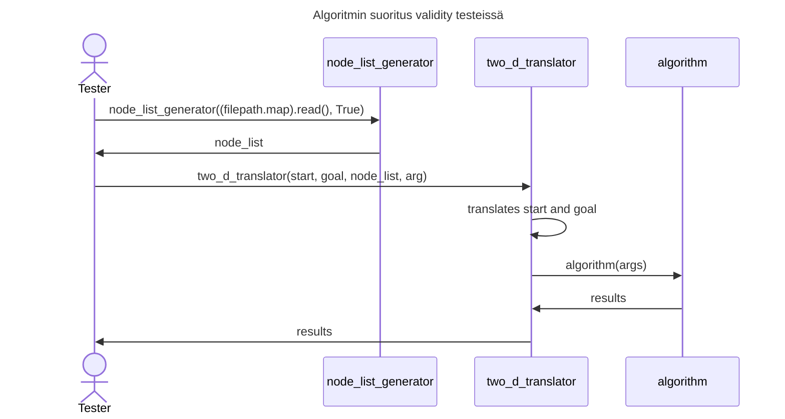
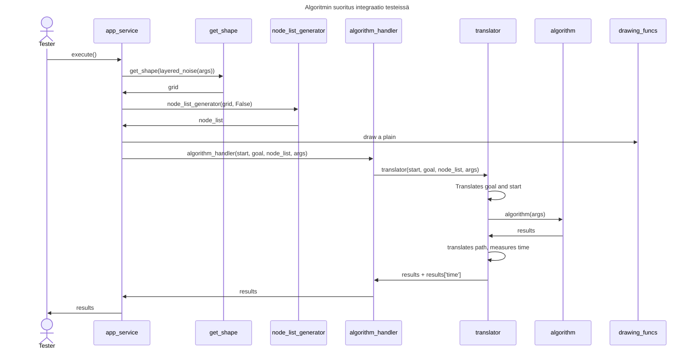

# Testidokumentti

Ohjelmassa lähes kaikki keskeiset funktiot on testattu niille tarkoitetuille unittesteillä. Sen lisäksi itse algoritmejä on testattu neljällä eri tavalla.

## Testikattavuus

Testikattavuusraportista on jätetty pois draw_functions, ui sekä index. Shape functions tiedostossa on erillisiä metodeita jotka on jätetty testikattavuuden ulkopuolelle, sillä niitä ei käytetä ohjelman suorituksessa.

## Erilaisia testejä

app_engine_test, linked_list_test, node_list_generator_test, translator_test ovat kaikki simplleleitä unit testejä. Niissä testataan algoritmejä tukevia metodeita.

Loput testeistä testaa algoritmejä. Jokainen tulevista testeistä suoritetaan kaikille kolmelle algoritmille.

#### algorithm_blank_3_test

Testit tässä tiedostossa tapahtuu 3x3 tyhjällä 2d kartalla. Tällä kartalla testataan muutamia tilanteita ja tarkistetaan että algoritmejen reitit ovat oikeaita ja että algoritmejen käydyt solut ovat tarkoituksenmukaisia.

#### algorithm_dot_3_test

Testit itsessään on samanlaisia kuin blank_3 testit, mutta kartta on 3x3 ruutu jossa on läpipääsemätön seinä keskellä.

#### algorithm_validity_test

Varmistuaksemme algoritmejen oikeellisuudesta tässä tiedostossa testataan algoritmejä movingai kartoissa pelistä bouldersgate 2. Tiedoston avulla voimme suoritaa kaikki tilanteet jotka löytyvät map_generation/maps kansiosta. Olen suorittanut kotikoneella enemmänkin testejä, mutta oletukseksi on jätetty nopeite suoritettavissa oleva datasetti.

Nämä testit suoritetaan oikeestaan että voidaan olla aivan varmoja djikstran oikeellisuudesta, jotta tulevissa testeissä voidaan pitää sen syötteitä erilaisilla kartoilla vertailukohtana.

#### algorithm_performance_test

Täällä suoritetaan testejä itse generoiduissa kartoissa. Tiedoston nimen mukaan juoksemme performance testejä mitaten aikaa. Fringe searchin performancea ei vertailla suoraan unittestillä sillä se on huomattavasti hitaampi kuin djikstra ja a_star. Testejen aikana varmistetaan kuitenkin että a_starin ja fringe_searchin tulosteet vastaavat djikstran tulostetta, jonka oletamme oikeaksi. Isoimmat suoritetut testimäärät tällä testillä on sample size 500 tilannetta joissa jokaisessa 2500 nodea.

#### integration_test

Täällä kutsutaan suoraan AppEngine luokkaa josta käsin suoritetaan kaikki algoritmit eri satunnaisella siemenellä, ja varmistetaan että niiden reittien pituudet ovat lyhyimmät mahdolliset.

