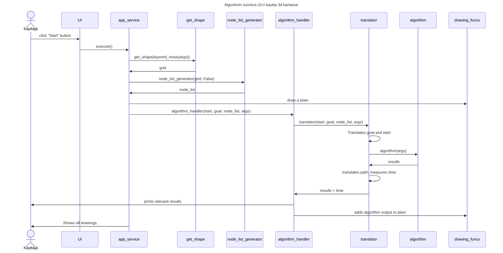
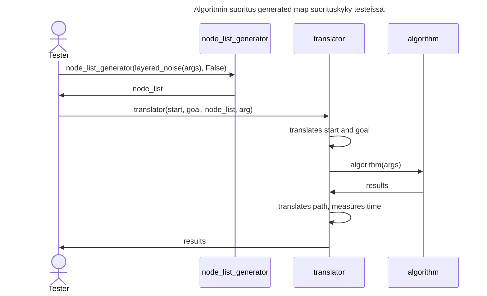
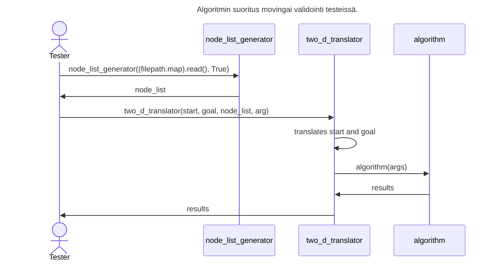

# Toetutusdokumentti

Projektissa on toteutettu 3 eri reitinetsintä algoritmia. Pääpainona on onnlut Fringe search algoritmi jota vertaillaa a* algoritmiin. Dijkstra on tullut ns. vahingossa mukaan ja implementoitu antamalla a_star algoritmin heureettiseksi funktioksi 0.

## Ohjelman rakenne

```text
    └── src                    
        ├── index.py
        ├── functions
        |   ├── fringe_search.py
        |   ├── a_star.py
        |   ├── height_mapping_function.py
        |   └── heurestic_function.py
        |
        ├──objects
        |   ├── node.py
        |   └── doubly_linked_list.py
        |
        ├──services
        |   ├── algorithm_handler.py
        |   └── running_service.py
        |
        ├── map_generation
        |   ├── get_shape.py
        |   ├── shape_functions.py
        |   ├── node_list_generator.py
        |   ├── translator.py
        |   ├── two_d_translator.py
        |   └── maps
        |       └── ...
        |   
        └── drawing_functions
            ├── draw_path.py
            ├── draw_pointmap.py
            └── draw_plots.py
            

```

## File docstring

### index.py

- index runs the program
- Combines all the other methods and classes and executes them in the right order etc.

### functions

- Holds the neccessary functions for execution of the algorithms.
- a_star.py and fringe_search.py are those algorithms respectively.
- heurestic.py and two_d_heurestic.py hold heurestic functions for 3d and 2d navigation.
- height_mapping.py holds height mapping function for 3d maps.

### Objects

- Holds the neccessary objects for execution of the algorithms.
- node.py and two_d_node.py hold node objects for 3d and 2d maps.
- doubly_linked_list.py holds doubly linked list object that has the following cabibilities.
  * Check if object in list in O(0) time.
  * Remove object from list in O(0) time.
  * Remove current object in O(0) time.
  * iterate 
  * get current

### Services

- algorithm handler holds a single method. It's a middleman in running the algorithms from index.
  - calls drawing functions and prints everything to console.
- running_service.py holds a class that is the boundary layer between UI and the rest of the program.

### Map generation

- get_shape has a function that given a function f(x, y) = z generates a map of given dataresolutioin and data range.
- shape_functions holds multiple functions intended for use with get_shape. Most of them are there for ns. storage. The one that is usesd is layered_noise.
- node_list_generator.py holds a method that takes in either a 2d or 3d raw map and converts it to node_lists. 
- tranlators (translator.py and two_d_translator.py) hold functions that take in nodelist an algorithm parameters then translates parameters like start, goal and path between node_list and actual cordinates.
- maps is a directory holding multiple movingai maps and their solutions. Only one is used, but the rest are there for possible further implementation.

### Drawing functions

  - holds 3 functions responsible for the visuals

## Erilaisia tapoja suorittaa algoritmi



Ylläoleva taulukko on tarkoitettu antamaan lukija yleiskuva miten algoritmin suoritus toimii UI:n kautta 3d kartassa. Siitä puuttuu  hieman  nuanssia.




